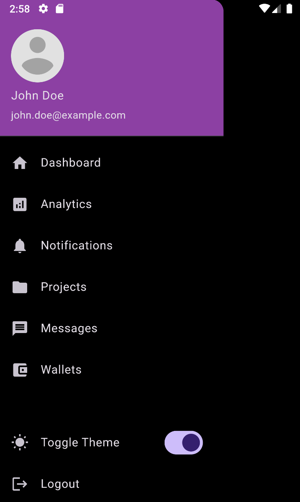

# Profile Navigator
A Flutter application featuring a custom drawer with user profile information, settings, and navigation to various sections of the app. The app supports both light and dark themes.

## 🌟 Features
- Custom drawer with user profile section
- Navigation to Dashboard, Analytics, Notifications, Projects, Messages, Wallets, and Settings
- Light and dark theme toggle
- Modern and responsive design

## 📸 Screenshots
### Dark Drawer


### Light Drawer
)

## 🛠️ Technologies Used
- **Frontend**: Flutter, Dart
- **State Management**: Provider
- **Plugins**: None required

## 📝 Setup Instructions
Follow these steps to set up the project locally:

### 1. Clone the Repository
```bash
git clone https://github.com/obadaKraishan/ProfileNavigator.git
cd ProfileNavigator
```

### 2. Install Dependencies
```bash
flutter pub get
```

### 3. Run the Application
```bash
flutter run
```

## 📄 Project Structure
```plaintext
lib/
├── assets/                  
│   ├── fonts/               
│   ├── images/              
│       └── avatar.png       
│
├── constants/               
│   └── colors.dart          
│
├── models/                  
│   └── user.dart            
│
├── screens/                 
│   ├── analytics_screen.dart
│   ├── home_screen.dart
│   ├── messages_screen.dart
│   ├── notifications_screen.dart
│   ├── profile_screen.dart
│   ├── projects_screen.dart
│   ├── settings_screen.dart
│   ├── wallets_screen.dart
│
├── utils/                   
│   └── theme_notifier.dart  
│
├── widgets/                 
│   ├── custom_drawer.dart   
│   ├── drawer_item.dart     
│   └── user_profile.dart    
│
├── main.dart                
│
└── routes.dart              
```

## 🎨 Customization
### 1. Update Theme
Modify the theme settings in `constants/colors.dart` to customize the app's look and feel.

### 2. Update Drawer Items
Adjust the navigation items in `widgets/custom_drawer.dart` to add or remove items as needed.

### 3. Add New Screens
Create new screens in the `screens/` directory and update `routes.dart` to include them in the app's navigation.

## 📄 License
This project is licensed under the MIT License - see the [LICENSE](LICENSE) file for details.

## 👥 Contributors
- [Obada Kraishan](https://github.com/obadaKraishan)

